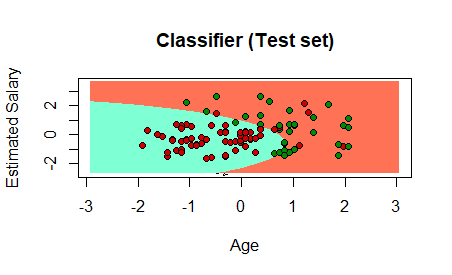

# MINERIA-DATOS
 
 Unit-3
# Unit # 3 

## Practica #1
[Link PDF](https://github.com/Aliciap26/MINERIA-DATOS/blob/Unit-3/Practices/_Pr%C3%A1ctica%201%20-%20Unidad%203.pdf)

[Link R](https://github.com/Aliciap26/MINERIA-DATOS/blob/Unit-3/Practices/practice%231)

 ~~~
 ##We will import the file to R
##Importing the dataset
        dataset <- read.csv('Salary_Data.csv')

##Splitting the dataset into the Training set and Test set
##Install.packages('caTools')

        library(caTools)
        set.seed(123)
        split <- sample.split(dataset$Salary, SplitRatio = 2/3)
        training_set <- subset(dataset, split == TRUE)
        test_set <- subset(dataset, split == FALSE)

##Fitting Simple Linear Regression to the Training set
            regressor = lm(formula = Salary ~ YearsExperience,
                       data = dataset)
            summary(regressor)

##Predicting the Test set results

        y_pred = predict(regressor, newdata = test_set)

##Visualising the Training set results

            library(ggplot2)
            ggplot() + geom_point(aes(x=training_set$YearsExperience, y=training_set$Salary) + color = 'red') + geom_line(aes(x = training_set$YearsExperience, y = predict(regressor, newdata = training_set)),
                    color = 'blue') + ggtitle('Salary vs Experience (Training Set)') + xlab('Years of experience') + ylab('Salary')

##Visualising the Test set results

            ggplot() + geom_point(aes(x=test_set$YearsExperience, y=test_set$Salary), color = 'red') + geom_line(aes(x = training_set$YearsExperience, y = predict(regressor, newdata = training_set)),
                    color = 'blue') + ggtitle('Salary vs Experience (Test Set)') + xlab('Years of experience') + ylab('Salary')
 ~~~
 ## Practica #2
[Link PDF](https://github.com/Aliciap26/MINERIA-DATOS/blob/Unit-3/Practices/Pr%C3%A1ctica-2-U3.pdf)

[Link R](./Practices/practice2.R)
                    
~~~
# Importing the dataset
dataset <- read.csv(file.choose())
# Encoding categorical data 
dataset$State = factor(dataset$State,
                       levels = c('New York', 'California', 'Florida'),
                       labels = c(1,2,3))

dataset
# Splitting the dataset into the Training set and Test set
install.packages('caTools')
library(caTools)
set.seed(123)
split <- sample.split(dataset$Profit, SplitRatio = 0.8)
training_set <- subset(dataset, split == TRUE)
test_set <- subset(dataset, split == FALSE)

# Fitting Multiple Linear Regression to the Training set
#regressor = lm(formula = Profit ~ R.D.Spend + Administration + Marketing.Spend + State)
regressor = lm(formula = Profit ~ .,
               data = training_set )

summary(regressor)

# Prediction the Test set results
y_pred = predict(regressor, newdata = test_set)
y_pred

# Assigment: visualize the siple liner regression model with R.D.Spend 

# Building the optimal model using Backward Elimination
regressor = lm(formula = Profit ~ R.D.Spend + Administration + Marketing.Spend + State,
               data = dataset )
summary(regressor)

regressor = lm(formula = Profit ~ R.D.Spend + Administration + Marketing.Spend,
               data = dataset )
summary(regressor)

regressor = lm(formula = Profit ~ R.D.Spend + Marketing.Spend,
               data = dataset )
summary(regressor)

regressor = lm(formula = Profit ~ R.D.Spend,
               data = dataset )
summary(regressor)

y_pred = predict(regressor, newdata = test_set)
y_pred

# Homework analise the follow atomation backwardElimination function 
backwardElimination <- function(x, sl) {
  numVars = length(x)
  for (i in c(1:numVars)){
    regressor = lm(formula = Profit ~ ., data = x)
    maxVar = max(coef(summary(regressor))[c(2:numVars), "Pr(>|t|)"])
    if (maxVar > sl){
      j = which(coef(summary(regressor))[c(2:numVars), "Pr(>|t|)"] == maxVar)
      x = x[, -j]
    }
    numVars = numVars - 1
  }
  return(summary(regressor))
}

SL = 0.05
#dataset = dataset[, c(1,2,3,4,5)]
training_set
backwardElimination(training_set, SL)
~~~

## Practica #3
[Link PDF](https://github.com/Aliciap26/MINERIA-DATOS/blob/Unit-3/Practices/Pr%C3%A1ctica-2-U3.pdf)

[Link R](./Practices/practice3.R)

~~~
#getwd()
#setwd("/home/chris/Documents/itt/Enero_Junio_2020/Mineria_de_datos/DataMining/MachineLearning/LogisticRegression")
#getwd()

# Importing the dataset
dataset <- read.csv(file.choose())
dataset <- dataset[, 3:5]

# Splitting the dataset into the Training set and Test set
# Install.packages('caTools')
library(caTools)
set.seed(123)
split <- sample.split(dataset$Purchased, SplitRatio = 0.75)
training_set <- subset(dataset, split == TRUE)
test_set <- subset(dataset, split == FALSE)

# Feature scaling
training_set[, 1:2] <- scale(training_set[, 1:2])
test_set[, 1:2] <- scale(test_set[, 1:2])

# Fitting Logistic Regression to Training set
classifier = glm(formula = Purchased ~ .,
                 family = binomial,
                 data = training_set)

# Predicting the Test set results
prob_pred = predict(classifier, type = 'response', newdata = test_set[-3])
prob_pred
y_pred = ifelse(prob_pred > 0.5, 1, 0)
y_pred

# Making the Confusion Metrix
cm = table(test_set[, 3], y_pred)
cm

# 
library(ggplot2)
ggplot(training_set, aes(x=EstimatedSalary, y=Purchased)) + geom_point() + 
  stat_smooth(method="glm", method.args=list(family="binomial"), se=FALSE)

ggplot(training_set, aes(x=Age, y=Purchased)) + geom_point() + 
  stat_smooth(method="glm", method.args=list(family="binomial"), se=FALSE)

ggplot(test_set, aes(x=EstimatedSalary, y=Purchased)) + geom_point() + 
  stat_smooth(method="glm", method.args=list(family="binomial"), se=FALSE)

ggplot(test_set, aes(x=Age, y=Purchased)) + geom_point() + 
  stat_smooth(method="glm", method.args=list(family="binomial"), se=FALSE)

# Visualization the Training set result
# install.packages('ElemStatLearn') No work for me, 
# manual mode. Go to this URL https://cran.r-project.org/src/contrib/Archive/ElemStatLearn/
# Download with the latest date 2019-08-12 09:20	12M
# Then follow this page steps https://riptutorial.com/r/example/5556/install-package-from-local-source

library(ElemStatLearn)
set = training_set
X1 = seq(min(set[, 1]) - 1, max(set[, 1]) + 1, by = 0.01)
X2 = seq(min(set[, 2]) - 1, max(set[, 2]) + 1, by = 0.01)
grid_set = expand.grid(X1, X2)
colnames(grid_set) = c('Age', 'EstimatedSalary')
prob_set = predict(classifier, type = 'response', newdata = grid_set)
y_grid = ifelse(prob_set > 0.5, 1, 0)
plot(set[, -3],
     main = 'Logistic Regression (Training set)',
     xlab = 'Age', ylab = 'Estimated Salary',
     xlim = range(X1), ylim = range(X2))
contour(X1, X2, matrix(as.numeric(y_grid), length(X1), length(X2)), add = TRUE)
points(grid_set, pch = '.', col = ifelse(y_grid == 1, 'springgreen3', 'tomato'))
points(set, pch = 21, bg = ifelse(set[, 3] == 1, 'green4', 'red3'))

# Visualising the Test set results
library(ElemStatLearn)
set = test_set
X1 = seq(min(set[, 1]) - 1, max(set[, 1]) + 1, by = 0.01)
X2 = seq(min(set[, 2]) - 1, max(set[, 2]) + 1, by = 0.01)
grid_set = expand.grid(X1, X2)
colnames(grid_set) = c('Age', 'EstimatedSalary')
prob_set = predict(classifier, type = 'response', newdata = grid_set)
y_grid = ifelse(prob_set > 0.5, 1, 0)
plot(set[, -3],
     main = 'Logistic Regression (Test set)',
     xlab = 'Age', ylab = 'Estimated Salary',
     xlim = range(X1), ylim = range(X2))
contour(X1, X2, matrix(as.numeric(y_grid), length(X1), length(X2)), add = TRUE)
points(grid_set, pch = '.', col = ifelse(y_grid == 1, 'springgreen3', 'tomato'))
points(set, pch = 21, bg = ifelse(set[, 3] == 1, 'green4', 'red3'))
~~~

## Practica #4
[Link PDF](./Practices/Practice4.pdf)

[Link R](/Practices/practice4.R)
~~~ 
# Importing the dataset
dataset = read.csv('Social_Network_Ads.csv')
dataset = dataset[3:5]

 Encoding the target feature as factor
dataset$Purchased = factor(dataset$Purchased, levels = c(0, 1))

# Splitting the dataset into the Training set and Test set
# install.packages('caTools')
library(caTools)
set.seed(123)
split = sample.split(dataset$Purchased, SplitRatio = 0.75)
training_set = subset(dataset, split == TRUE)
test_set = subset(dataset, split == FALSE)

# Feature Scaling
training_set[-3] = scale(training_set[-3])
test_set[-3] = scale(test_set[-3])

 Fitting K-NN to the Training set and Predicting the Test set 
results
library(class)
y_pred = knn(train = training_set[, -3],
test = test_set[, -3],
 cl = training_set[, 3],
 k = 5,
 prob = TRUE)

# Making the Confusion Matrix
cm = table(test_set[, 3], y_pred)

 Visualising the Training set results
install.packages('ElemStatLearn')
library(ElemStatLearn)
set = training_set
X1 = seq(min(set[, 1]) - 1, max(set[, 1]) + 1, by = 0.01)
X2 = seq(min(set[, 2]) - 1, max(set[, 2]) + 1, by = 0.01)
grid_set = expand.grid(X1, X2)
colnames(grid_set) = c('Age', 'EstimatedSalary')
y_grid = knn(train = training_set[, -3], test = grid_set, cl = 
training_set[, 3], k = 5)
plot(set[, -3],
 main = 'K-NN (Training set)',
 xlab = 'Age', ylab = 'Estimated Salary',
 xlim = range(X1), ylim = range(X2))
contour(X1, X2, matrix(as.numeric(y_grid), length(X1), 
length(X2)), add = TRUE)
points(grid_set, pch = '.', col = ifelse(y_grid == 1, 
'springgreen3', 'tomato'))
points(set, pch = 21, bg = ifelse(set[, 3] == 1, 'green4', 'red3'))
~~~

## Practica evaluatoria
[Link DOC](https://github.com/Aliciap26/MINERIA-DATOS/blob/Unit-3/Practices/Unidad_3_Mineria_De_Datos.docx )

[Link R](./Evaluation/evaluation-unit-3.r)
~~~ 
##Alicia P�rez.
##Erwin Howard.

# Importing the dataset
dataset <- read.csv(file.choose())

dataset <- read.csv('Social_Network_Ads.csv')
dataset = dataset[3:5]

# Encoding the target feature as factor
dataset$Purchased = factor(dataset$Purchased, levels = c(0, 1))

# Splitting the dataset into the Training set and Test set
install.packages('caTools')
library(caTools)
set.seed(123)
split = sample.split(dataset$Purchased, SplitRatio = 0.75)
training_set = subset(dataset, split == TRUE)
test_set = subset(dataset, split == FALSE)

# Feature Scaling
training_set[-3] = scale(training_set[-3])
test_set[-3] = scale(test_set[-3])

# Fitting SVM to the Training set
install.packages('e1071')
library(e1071)
classifier = naiveBayes(formula = Purchased ~ .,data = training_set,type = 'C-classification',kernel = 'linear')

# Predicting the Test set results
y_pred = predict(classifier, newdata = test_set[-3])
# Making the Confusion Matrix
cm = table(test_set[, 3], y_pred)
# Visualising the results
install.packages('ElemStatLearn')
library(ElemStatLearn)
set = test_set
X1 = seq(min(set[, 1]) - 1, max(set[, 1]) + 1, by = 0.01)
X2 = seq(min(set[, 2]) - 1, max(set[, 2]) + 1, by = 0.01)
grid_set = expand.grid(X1, X2)
colnames(grid_set) = c('Age', 'EstimatedSalary')
y_grid = predict(classifier, newdata = grid_set)
plot(set[, -3], main = 'Classifier (Test set)',
     xlab = 'Age', ylab = 'Estimated Salary',
     xlim = range(X1), ylim = range(X2))

contour(X1, X2, matrix(as.numeric(y_grid), length(X1), length(X2)), add =
          TRUE)
points(grid_set, pch = '.', col = ifelse(y_grid == 1, 'coral1',
                                         'aquamarine'))
points(set, pch = 21, bg = ifelse(set[, 3] == 1, 'green4', 'red3'))

~~~

## Result of the Evaluative practice

=======
 Unit 1

- [Evaluation](https://github.com/Aliciap26/MINERIA-DATOS/blob/Unit-1/Evaluation/README.md)

- [Homeworks](https://github.com/Aliciap26/MINERIA-DATOS/blob/Unit-1/Homeworks/README.md)

- [Practices](https://github.com/Aliciap26/MINERIA-DATOS/blob/Unit-1/Practices/README.md)

- [Research](https://github.com/Aliciap26/MINERIA-DATOS/blob/Unit-1/Research/README.md)
 development
